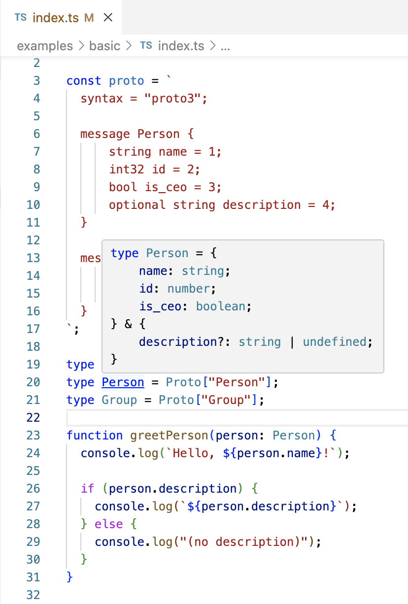

# protobuf-ts-types

> Zero-codegen TypeScript `type` inference from protobuf `message`s.

`protobuf-ts-types` lets you define language-agnostic `message` types in `proto` format, then infers TypeScript types from them with no additional codegen.

[Try on github.dev](https://github.dev/nathanhleung/protobuf-ts-types/blob/main/examples/basic/index.ts) | [View on CodeSandbox](https://codesandbox.io/p/github/nathanhleung/protobuf-ts-types/main?import=true&embed=1&file=%2Fexamples%2Fbasic%2Findex.ts)

> [!WARNING]
> Proof of concept, not production ready. See [Limitations](#limitations) below for more details.



## Usage

First, install the package.

```
npm install https://github.com/nathanhleung/protobuf-ts-types
```

Then, use it in TypeScript.

```ts
import { pbt } from "protobuf-ts-types";

const proto = `
    syntax = "proto3";

    message Person {
      string name = 1;
      int32 id = 2;
      bool is_ceo = 3;
      optional string description = 4;
    }

    message Group {
        string name = 1;
        repeated Person people = 2;
    }
`;

// `Proto` is a mapping of message names to message types, inferred from the
// `proto` source string above.
type Proto = pbt.infer<typeof proto>;

type Person = Proto["Person"];
type Person2 = pbt.infer<typeof proto, "Person">;

// `Person` and `Person2` are the same type:
// ```
// {
//     name: string;
//     id: number;
//     is_ceo: boolean;
//     description?: string;
// }
// ```

type Group = pbt.infer<typeof proto, "Group">;

function greetPerson(person: Person) {
  console.log(`Hello, ${person.name}!`);

  if (person.description) {
    console.log(`${person.description}`);
  } else {
    console.log("(no description)");
  }
}

function greetGroup(group: Group) {
  console.log(`=========${"=".repeat(group.name.length)}===`);
  console.log(`= Hello, ${group.name}! =`);
  console.log(`=========${"=".repeat(group.name.length)}===`);

  for (const person of group.people) {
    greetPerson(person);
    console.log();
  }
}

// If the structure of the `Group` or any of the individual `Person`s does not
// match the type, TypeScript will show an error.
greetGroup({
  name: "Hooli",
  people: [
    {
      name: "Gavin Belson",
      id: 0,
      is_ceo: true,
      description: "CEO of Hooli",
    },
    {
      name: "Richard Hendricks",
      id: 1,
      is_ceo: true,
      description: "CEO of Pied Piper",
    },
    {
      name: "Dinesh Chugtai",
      id: 2,
      is_ceo: false,
      description: "Software Engineer",
    },
    {
      name: "Jared Dunn",
      id: 3,
      is_ceo: false,
    },
  ],
});

// Output:
// ```
// =================
// = Hello, Hooli! =
// =================
// Hello, Gavin Belson!
// CEO of Hooli

// Hello, Richard Hendricks!
// CEO of Pied Piper

// Hello, Dinesh Chugtai!
// Software Engineer

// Hello, Jared Dunn!
// (no description)
// ```
```

## Limitations

* If not using inline (i.e., literals in TypeScript) proto `string`s `as const`, probably requires a [`ts-patch`](https://github.com/nonara/ts-patch) compiler patch to import `.proto` files until https://github.com/microsoft/TypeScript/issues/42219 is resolved
* `service`s and `rpc`s are not supported (only `message`s)
* `oneof` and `map` fields are not supported
* `import`s are not supported (for now, concatenate)

## API

### `pbt`

Top-level exported namespace.

```
import { pbt } from "protobuf-ts-types";
```

### `pbt.infer<Proto extends string, MessageName extends string = "">`

Given a proto source string, infers the types of the `message`s in the source.

#### Returns

* If `MessageName` is an empty string, the returned type is a mapping from message names to message types.
* If `MessageName` is a known `message`, the returned type is the inferred type of the given `MessageName`.
* If `MessageName` is not a known `message`, the returned type is `never`.
